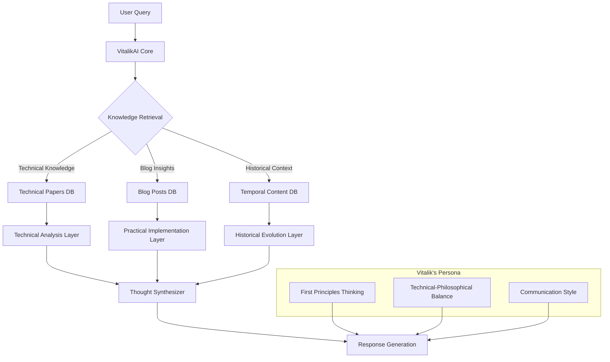
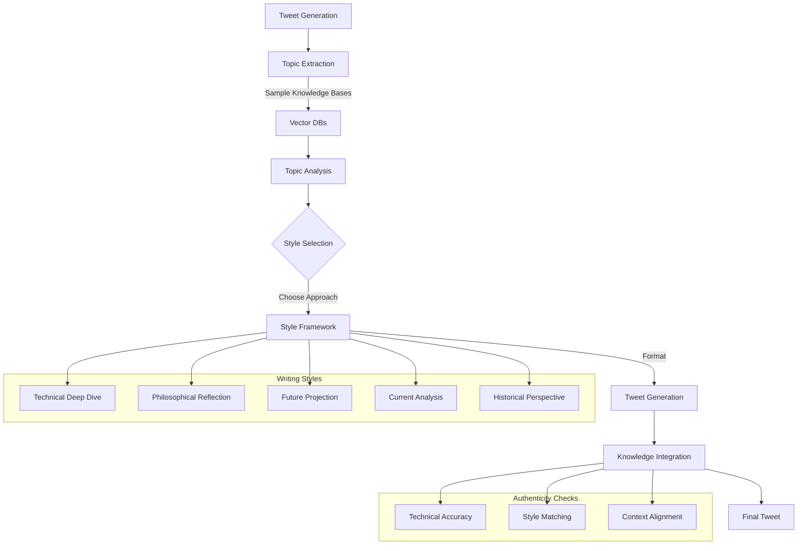

# VitalikAI

An attempt to replicate Vitalik Buterin's thought process, knowledge, and communication style in the form of an AI agent. The system leverages Vitalik's technical papers, blog posts, and historical content to generate responses and insights that align with his characteristic approach to blockchain, cryptography, and technological philosophy.

## System Architecture

### Base VitalikAI System
The core system emulates Vitalik's multi-layered thinking process by combining technical depth with philosophical considerations:



### VitalikAI Tweet Generator
An extension that generates Vitalik-style insights in tweet format:



# Running FastAPI:
```bash
python -m venv venv
```
```bash
.\venv\Scripts\activate
```
```bash
pip install -r requirements.txt
```
```bash
uvicorn api.conversation:app --reload
```